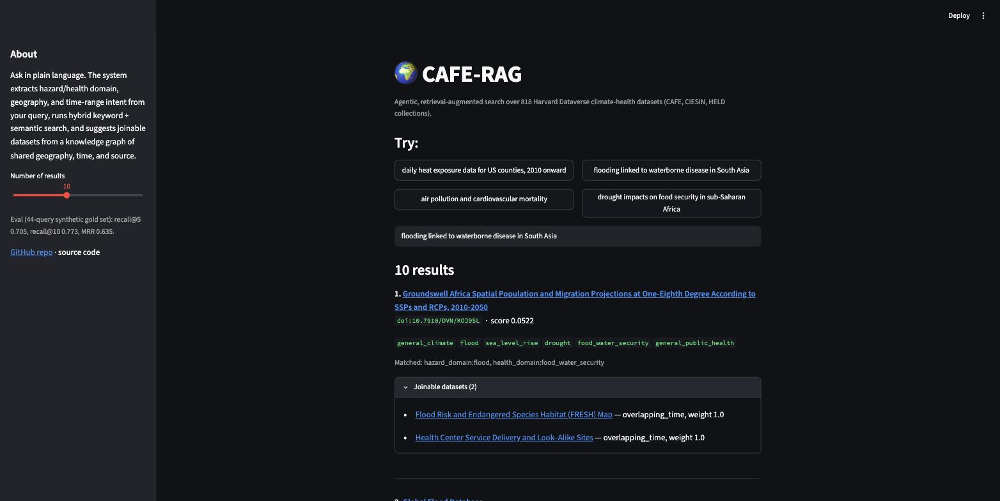

# CAFE-RAG

**An agentic, retrieval-augmented discovery layer for Harvard Dataverse's climate-health data.**

The CAFE, CIESIN, and HELD collections on Harvard Dataverse hold 1,000+
climate-and-health datasets on a generalist repository with no faceted
search — researchers are left to "browse file lists and apply basic
filters." CAFE-RAG lets you ask in plain language instead:

> *"daily heat exposure data for US counties, 2010 onward"*
> *"flooding linked to waterborne disease in South Asia"*

...and get back ranked datasets with DOIs, matched-signal explanations, and
suggestions for what else in the corpus you could join them with.



## Results

Built and evaluated end-to-end over all **818 datasets** across the CAFE,
CIESIN, and HELD collections:

| Metric | Score |
|---|---|
| recall@1 | 0.545 |
| recall@3 | 0.682 |
| recall@5 | 0.705 |
| recall@10 | 0.773 |
| MRR | 0.635 |

Measured on a 44-query synthetic gold set (pool depth 20) — see
[Phase 6](#phase-6-evaluate) for methodology and honest caveats about what
this metric does and doesn't prove.

## How it works

```
Dataverse API                                                    Streamlit UI
     │                                                                  ▲
     ▼                                                                  │
┌─────────┐   ┌───────────┐   ┌────────────────┐   ┌───────────┐   ┌─────────┐
│ Harvest │──▶│ Structure │──▶│  Index          │──▶│ Knowledge │──▶│ Hybrid  │
│ (1,317  │   │ (LLM +    │   │  FTS5 keyword + │   │ graph     │   │ RAG     │
│  raw    │   │  determ-  │   │  Chroma         │   │ (geo/time/│   │ retrieval│
│  records)│   │  inistic) │   │  semantic       │   │  source)  │   │ + eval  │
└─────────┘   └───────────┘   └────────────────┘   └───────────┘   └─────────┘
```

1. **Harvest** all dataset metadata from the Dataverse public API into
   SQLite.
2. **Structure** it: deterministic fields pulled straight from Dataverse's
   structured metadata, plus a local LLM (Ollama, `gemma4`) classifying
   hazard/health domain from free text.
3. **Index** it twice: FTS5 for keyword search, Chroma (`nomic-embed-text`
   embeddings) for semantic search.
4. **Link it**: a knowledge graph connecting datasets by shared geography,
   overlapping time period, and shared original source, so the system can
   answer "what can I join to this?"
5. **Retrieve**: an LLM extracts structured intent from the query (hazard/
   health domain, geography, time range); hybrid FTS5 + Chroma search is
   fused with Reciprocal Rank Fusion; results are boosted by matched intent
   and expanded with graph neighbors.
6. **Evaluate**: a synthetic gold query set (LLM-generated) scored with
   recall@k and MRR — built because an unevaluated RAG demo is the most
   common portfolio mistake in this space.
7. **Ship**: a Streamlit UI over the whole pipeline.

## Quickstart

```bash
python3 -m venv .venv && source .venv/bin/activate
pip install -r requirements.txt

# requires Ollama running locally with gemma4 + nomic-embed-text pulled
python -m cafe_rag.harvest      # Phase 1
python -m cafe_rag.structure    # Phase 2
python -m cafe_rag.index        # Phase 3
python -m cafe_rag.graph        # Phase 4

streamlit run app.py            # Phase 7 UI, backed by Phase 5 retrieval
```

---

## Pipeline details

### Phase 1: Harvest

```bash
# confirm HELD's collection alias first (uncomment it in config.py once known)
python scripts/find_collection_alias.py "Harvard Environment and Law Data"

# harvest all configured collections into data/cafe_rag.db
python -m cafe_rag.harvest

# useful flags
python -m cafe_rag.harvest --collections CAFE CIESIN
python -m cafe_rag.harvest --skip-details   # search hits only, fast pass
python -m cafe_rag.harvest --force          # re-fetch, ignore cache
```

Output:
- `data/raw/search/<collection>/start_*.json` — cached raw search pages
- `data/raw/datasets/<doi>.json` — cached raw per-dataset metadata
- `data/cafe_rag.db` — SQLite `raw_datasets` table (search + metadata JSON)

The harvester is resumable: interrupt it any time, re-run, and it skips
anything already cached on disk. 1,317 raw records harvested, collapsing to
818 distinct datasets once overlapping collection membership is
deduplicated.

### Phase 2: Structure

```bash
python -m cafe_rag.structure                # process all pending datasets
python -m cafe_rag.structure --limit 20      # smoke test on a small batch
```

Extracts the normalized `StructuredDataset` schema (schema.py) per dataset:
deterministic fields pulled straight from Dataverse's structured metadata,
plus an LLM classification pass (Ollama, `gemma4`) for hazard/health domains
and units mentioned. Resumable — only processes datasets missing a
`structured_datasets` row.

### Phase 3: Index

```bash
python -m cafe_rag.index                # build both indexes
python -m cafe_rag.index --skip-vectors # FTS5 only (fast, no LLM calls)
python -m cafe_rag.index --skip-fts     # Chroma only
```

Builds the search backbone Phase 5 (RAG + agentic retrieval) queries:
- **FTS5** (`dataset_fts` table in `cafe_rag.db`) — keyword/lexical search
  over title, description, keywords, subjects.
- **Chroma** (`data/chroma/`, collection `cafe_rag_datasets`) — semantic
  search via `nomic-embed-text` embeddings (Ollama, local, 768-dim) over
  the same fields used for Phase 2's LLM classification prompt.

Both passes are resumable: FTS5 skips rows already in `dataset_fts`, Chroma
skips ids already present in the collection.

### Phase 4: Knowledge graph

```bash
python -m cafe_rag.graph                                  # rebuild all edge types
python -m cafe_rag.graph --edge-types same_geography same_source
```

Links datasets so the system can answer "what can I join to this?" Not
incrementally resumable like Phases 1-3 — pairwise computation over 818
datasets is cheap (a few seconds), so each run recomputes and replaces each
edge type from scratch. Edge types, stored in `dataset_edges` with a 0-1
weight:

- `same_geography` — shared `geographic_coverage` tag (tags used by more
  than 25 datasets, like "United States" or "Global", are skipped so the
  graph doesn't collapse into a near-complete clique)
- `same_source` — identical `source_data` string (e.g. both derived from
  "NHANES — CDC")
- `overlapping_time` — intersecting year ranges, weighted by the overlap's
  fraction of the shorter range
- `bbox_overlap` — intersecting geographic bounding boxes, weighted by
  intersection area as a fraction of the smaller box

Query with `db.get_related_datasets(conn, persistent_id, edge_type=None,
min_weight=0.0, limit=20)`.

### Phase 5: Retrieval

```bash
python -m cafe_rag.retrieval "daily heat exposure data for US counties, 2010 onward"
python -m cafe_rag.retrieval "flooding linked to waterborne disease in South Asia" --k 5
```

Hybrid RAG + agentic retrieval, built on Phases 3-4:

1. **Query understanding** (`extract_query.py`) — an LLM call (gemma4)
   extracts structured intent from the query: hazard/health domains (same
   fixed vocab as Phase 2), free-text geographic hints, and a year range.
2. **Hybrid search** — FTS5 keyword search and Chroma semantic search each
   return a top-30 candidate list; merged with Reciprocal Rank Fusion (RRF,
   k=60) rather than raw score blending, since bm25 and cosine distance
   aren't on comparable scales.
3. **Filter-match boost** — candidates whose metadata actually matches the
   extracted intent get a small score bump per matched signal. This is a
   soft boost, not a hard filter: roughly half of `structured_datasets` have
   empty hazard/health domains, so excluding on them would drop plenty of
   genuinely relevant, just-under-classified datasets.
4. **Graph expansion** — each top result gets 1-2 "you can join this with"
   suggestions pulled from Phase 4's knowledge graph (weight >= 0.6).

Known limitation: graph-expansion suggestions lean on `overlapping_time`,
and a few long-running government datasets have year ranges wide enough to
overlap almost everything, so they show up as "joinable" more than they're
actually useful. Worth tightening (e.g. require geography+time together).

### Phase 6: Evaluate

```bash
python -m cafe_rag.gold_set --n 50   # (re)generate the gold query set
python -m cafe_rag.evaluate          # score retrieval.py against it
```

No human relevance-judgment log exists, so the gold set is synthetic:
sample datasets, have the LLM write a realistic query for each ("what would
a researcher type to find this dataset?"), then check whether retrieval
finds the source dataset back. Near-duplicate datasets (same title +
description, 33 of 818 fall into 11 such groups) are all counted as
relevant, so exact duplicates don't unfairly penalize the score.

**Caveat, worth reading before citing these numbers**: this measures
whether retrieval can find the document a query was generated *from* —
not full relevance judgment against the whole corpus. It won't catch cases
where a genuinely better dataset exists and legitimately outranks the
source. Treat recall@k/MRR here as a lower bound on real-world usefulness,
not a ceiling. In this harness, the misses cluster almost entirely around
generic queries (e.g. "environmental health risks and climate change
impacts on human populations") where many datasets plausibly compete with
the source one — an expected failure mode of synthetic-query eval, not
obviously a retrieval bug.

Results are written to `data/eval_results.json` (aggregate metrics +
per-query rank) for reproducibility.

### Phase 7: Ship

`app.py` is a Streamlit UI over `retrieval.search()`: a query box, example
queries, results with matched-signal explanations and domain tags, and an
expandable "joinable datasets" panel per result (Phase 4's knowledge graph)
linking out to Harvard Dataverse.

One bug found and fixed while building this: Streamlit's `st.cache_resource`
can rerun a cached SQLite connection from a different worker thread than
the one that created it, which trips `sqlite3`'s same-thread check. Fixed
with `check_same_thread=False` in `db.connect` (see the docstring there) —
safe here since the app is single-user and reruns are sequential, not
concurrent.

## Repo layout

```
src/cafe_rag/
  config.py               collections to harvest, API settings
  dataverse_client.py     thin wrapper over the Dataverse Search + Native APIs
  db.py                   SQLite schema and upsert/query helpers
  harvest.py              Phase 1 CLI entry point
  schema.py                StructuredDataset schema + hazard/health vocab (Phase 2)
  extract_deterministic.py Phase 2: pull structured fields straight from metadata
  extract_llm.py            Phase 2: LLM hazard/health domain classification
  structure.py              Phase 2 CLI entry point
  index.py                  Phase 3 CLI entry point (FTS5 + Chroma)
  graph.py                   Phase 4 CLI entry point (knowledge graph)
  extract_query.py            Phase 5: LLM query-intent extraction
  retrieval.py                 Phase 5 CLI entry point (hybrid RAG retrieval)
  gold_set.py                   Phase 6: synthetic gold query set generation
  evaluate.py                    Phase 6 CLI entry point (recall@k, MRR)
scripts/
  find_collection_alias.py   look up an unknown collection's alias
app.py                 Phase 7: Streamlit UI
docs/screenshot.jpg    UI screenshot used above
data/                  raw cache and sqlite db are gitignored (data/raw/, data/*.db);
                       everything else here (chroma store, gold set, eval results,
                       logs) is tracked
```

## Tech stack

Python · SQLite (FTS5) · Chroma · Ollama (`gemma4`, `nomic-embed-text`) ·
Pydantic · Streamlit
